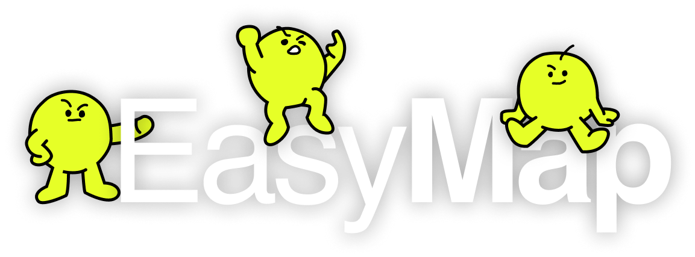

EasyMap è un'applicazione mobile sviluppata da tre studenti di Ingegneria Informatica dell'Università degli Studi di Salerno durante il SADB - Swift App Development Bootcamp. L'app offre una serie di funzionalità pensate per migliorare l'esperienza quotidiana all'interno del campus universitario.

## Funzionalità principali

* Mappa interattiva del campus: visualizza la disposizione delle aule, dei laboratori e degli altri edifici universitari.
* Aule disponibili: verifica in tempo reale la disponibilità delle aule per lo studio o per attività di gruppo.
* Bacheca digitale: consultazione di annunci, eventi e comunicazioni ufficiali dell'università.
* Missioni universitarie: partecipazione a missioni gamificate per incentivare l'esplorazione e la conoscenza del campus.

## Tecnologie utilizzate

* **Swift**
* **UIKit**
* **MapKit**
* **Python**

Sviluppata da Apicella Francesco, Campagna Lorenzo e Carbone Gaetano. EasyMap 2025